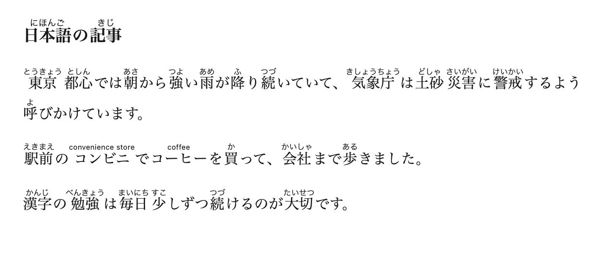
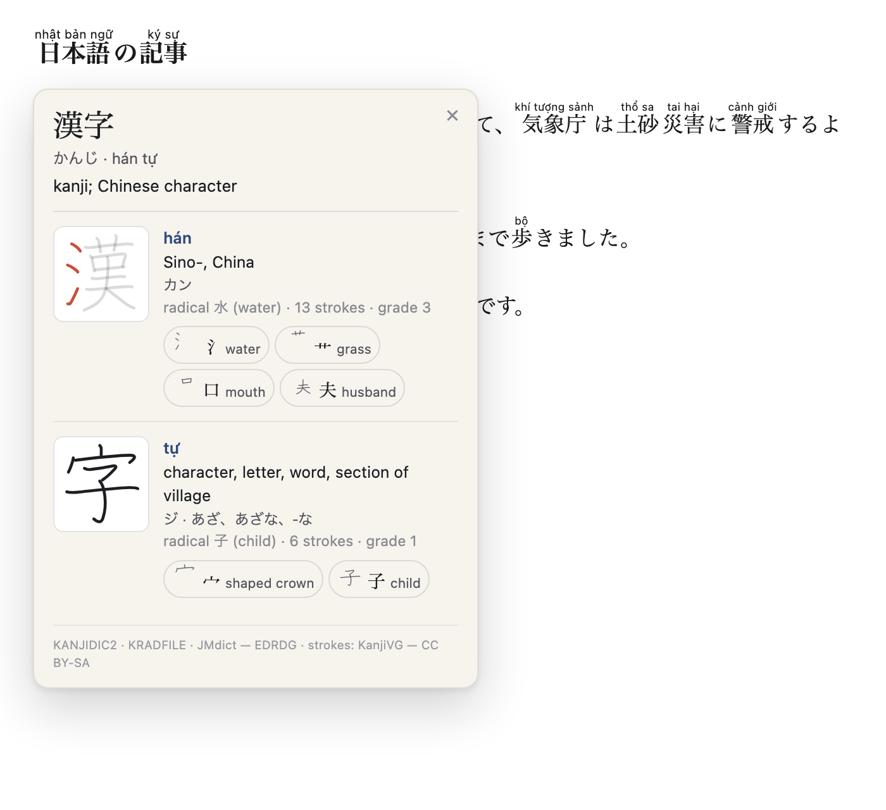
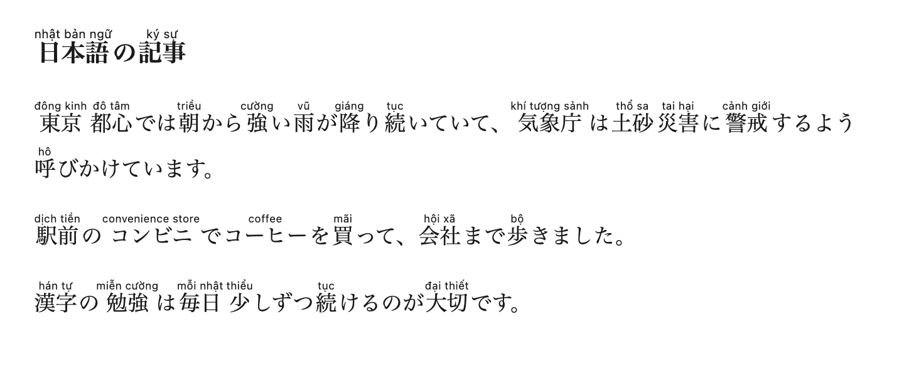
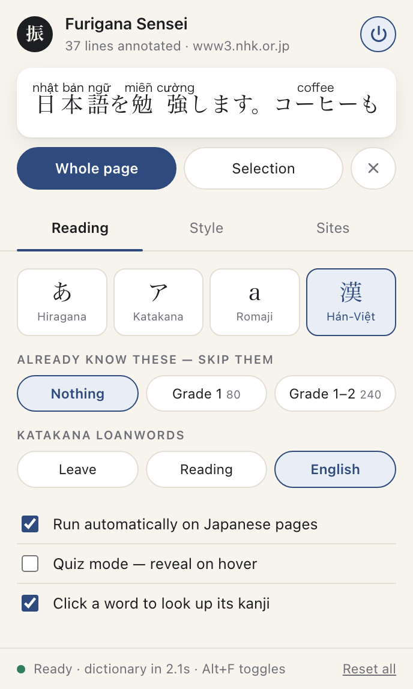

# Furigana Sensei

A Chrome (MV3) extension that prints furigana — hiragana, katakana or romaji readings —
above the kanji on any Japanese web page. Built along the same lines as
[Furigana Plus](https://chromewebstore.google.com/detail/furigana-plus/kaebmfgmehefgiphckeahegicpfddhan),
with a few extras: romaji output, Hán-Việt readings, a "skip the kanji I already know"
filter, a hover-reveal quiz mode, and a kanji reference panel.



## Install (unpacked)

1. Open `chrome://extensions` and turn on **Developer mode**.
2. Click **Load unpacked** and pick this folder (`furigana-sensei/`).
3. Open any Japanese page — try https://www3.nhk.or.jp/news/ — and the readings appear.

`npm run build` produces `dist/furigana-sensei.zip` for the Web Store instead.

## Features

| | |
|---|---|
| **Reading script** | ひらがな · カタカナ · romaji (modified Hepburn) · **Hán-Việt** (Sino-Vietnamese: 東京 → *đông kinh*) |
| **Okurigana-aware** | 食べる → 食<rt>た</rt>べる, not 食べる<rt>たべる</rt> |
| **Skip known kanji** | Hide readings for kyōiku grade 1 (80 kanji) or grades 1–2 (240 kanji) |
| **Katakana loanwords** | *Leave* them, show the **reading**, or show the **English word**: コーヒー → coffee, コンセント → power outlet, アルバイト → part-time job |
| **Quiz mode** | Readings stay hidden; annotated words keep a faint dotted rule so you know what to recall, and hovering fades the reading in |
| **Scope** | Whole page, current selection, or right-click → *Add furigana to selection* |
| **Per-site off switch** | Turn the current site off, and manage the whole blocklist, in the popup's *Sites* tab |
| **Undo** | *Remove* restores the original text nodes exactly |
| **Appearance** | Size, opacity, colour, line spacing |
| **Look up a word** | Click any annotated word for a panel: the word's meaning, then each kanji shown large in print form with its Hán-Việt, meanings, readings, radical, and the components it is built from |
| **Shortcut** | <kbd>Alt</kbd>+<kbd>F</kbd> toggles the current page |

Dynamic pages (infinite scroll, SPA routing) are handled by a `MutationObserver`, so
newly-loaded text gets furigana too.

### Seeing what it is doing

The service worker keeps one state machine — `idle → starting → loading → ready`, or
`error` — and both surfaces read from it:

- **The toolbar badge.** An amber `…` while the tokenizer is starting or the dictionary is
  loading, a red `!` if it failed, and otherwise the number of annotated lines on the
  current tab. Nothing to open: if the badge is blank and the page has no furigana, the
  extension simply has not been asked to do anything.
- **The status bar** along the bottom of the popup: a coloured dot plus one line — *Loading
  dictionary… 1.4s*, *Ready · dictionary in 2.1s*, or the actual error text. It polls every
  250 ms while something is happening and every 1.5 s once it settles. When the engine is
  idle or broken the bar offers a **Start** button, so you can trigger the load and watch it
  rather than guessing whether the 17 MB dictionary ever arrived.

`test/background.test.js` drives this state machine directly with a stubbed `chrome` API.

### Reloading the extension

Clicking *Reload* on `chrome://extensions` orphans the content scripts already running in
open tabs: `chrome.runtime.id` goes away and every `chrome.*` call from them throws
*"Extension context invalidated"*. The script notices, disconnects its `MutationObserver`
and stops, rather than filling the console with unhandled rejections. Furigana already on
the page stays — it is plain `<ruby>` markup — and reloading the tab re-injects the new
build.

### Mixed-language pages

Filtering happens per text node *and* per word, so on a page that mixes languages only the
Japanese is touched: "Our office is in 東京 and opens at 9am" gets furigana on 東京 alone,
and English, Korean and Vietnamese text is left exactly as it was.

Chinese is the one case that needs help — it is written in the same characters, so a
Japanese tokenizer will cheerfully read 我在北京 as わが・ざい・ぺきん. Any subtree whose
nearest `lang` attribute is `zh` is therefore skipped, while a `lang="ja"` block nested
inside it is still annotated. Chinese with no `lang` attribute at all cannot be told apart
from kanji-only Japanese (headlines like 経済成長率 are exactly that shape), so it is left to
the heuristic — turn the site off in the *Sites* tab if it gets noisy.

## The loanword dictionary

`src/loanwords.js` holds 343 katakana → English entries, bundled so nothing leaves the
browser. Where a word is wasei-eigo — coined in Japan, or borrowed from a language other
than English — the gloss is the **meaning**, not the source spelling:

| | | |
|---|---|---|
| マンション | condo | not "mansion" |
| コンセント | power outlet | not "consent" |
| アルバイト | part-time job | German *Arbeit* |
| サラリーマン | office worker | wasei-eigo |
| ホッチキス | stapler | from the Hotchkiss brand |

Those are exactly the words that trip learners up, so they are the ones worth glossing.
Lookup normalises the trailing 長音 (コンピュータ and コンピューター both resolve), and a word
that is not in the dictionary simply gets nothing — in English mode there is no fall back
to a kana reading, because spelling コンピューター back as こんぴゅーたー helps no one.

Glosses are kept short on purpose: a long annotation stretches the katakana underneath it
and breaks the line, so `パソコン` reads *PC*, not *PC (personal computer)*.

## The reference panel



Click a word that has furigana and a panel opens beside it:

- **The word** — its reading, its Hán-Việt, and an English gloss from JMdict (18,002 common
  entries). A word outside that list says so rather than guessing.
- **Each kanji, drawn rather than typeset** — a vector image from KanjiVG, with its
  Hán-Việt, meanings, on/kun readings, classical radical, stroke count and school grade.
  Hover it for stroke numbers; click it and the character redraws itself one stroke at a
  time, in order.
- **What it is built from** — a chip per component, each one a small drawing of that part
  *in the place it sits inside the character*, labelled with its meaning. Hover a chip and
  those strokes light up in the big character while the rest fades, so you can see exactly
  which piece is which.

Inside a link a plain click still follows the link; <kbd>Alt</kbd>+click opens the panel
there. The whole thing can be turned off in the popup.

The data — `data/kanji.json` (10,384 characters), `data/components.json` (253) and
`data/words.json` (18,002) — is built by `tools/build-kanji.py` and totals 2.4 MB, fetched
the first time you open the panel and never before.

**Why the kanji are images.** A page that does not load a Japanese font falls back to a
Chinese one, and the glyphs genuinely differ — 骨, 直, 次 and samples like them are drawn
differently in the two languages, so a learner copying the shape off the screen would be
copying the wrong one. An SVG from KanjiVG always shows the Japanese form, whatever the
page's fonts are, and carries stroke order with it.

`data/strokes/` is 5.4 MB across 84 shards, keyed by the first two hex digits of the
codepoint, so looking at one kanji fetches about 60 KB rather than the lot. Paths are
rounded to one decimal — plenty for a 109-unit viewBox drawn at 74 px, and a fifth smaller
than KanjiVG's two.

**Where the components come from.** KanjiVG's SVGs are built out of nested
`<g kvg:element="…">` groups, and that nesting is a real decomposition: 漢 is 氵 + 艹 + 口 +
夫, 勉 is 免 + 力. Each group also owns a run of consecutive strokes, which is what makes
the highlight possible — a component is simply a stroke range. 6,197 of the 6,413 drawn
kanji have a breakdown this way.

KRADFILE is the fallback for the rest, and it is a different kind of thing: a *visual*
index built for radical-based lookup, not an etymology. It lists 亜 as ｜一口 because that
is what the glyph looks like, and it writes several radical forms as an ordinary kanji that
contains them — 漢 appears with 汁, meaning 氵, not "soup". The build script finds every one
of those mechanically (radkfile records the stroke count of the shape a radical stands for,
so a mismatch against the character's own count gives them away) and takes the meaning from
the classical radical its kanji overwhelmingly share: 汁 → 水 *water* at 88% agreement, 忙 →
心 *heart* at 99%. Where they share no radical — the stand-in marks a shape that can sit
anywhere in the glyph, like 灬 — no meaning is claimed at all and the chip says
"shape — also in 点馬魚" instead.

## Hán-Việt readings



`data/hanviet.json` maps 9,689 kanji to their Sino-Vietnamese reading — 2,126 of the 2,136
jōyō and 775 jinmeiyō. It is built by `tools/build-hanviet.py` from three sources, none of
them vendored:

| source | role |
|---|---|
| [hanviet-pinyin-words](https://www.npmjs.com/package/hanviet-pinyin-words) (MIT) | the readings, keyed by character and numbered pinyin |
| [Unihan](https://www.unicode.org/Public/UCD/latest/ucd/) | `kMandarin` decides *which* reading is primary; variant fields bridge Chinese simplifications |
| [kyujitai](https://www.npmjs.com/package/kyujitai) (MIT) | shinjitai → kyūjitai, which Unihan does not carry for Japan-only simplifications |

Three things that make this non-obvious:

- **Unihan's `kVietnamese` field is the wrong one.** It records chữ Nôm readings, not
  Hán-Việt — it gives 東 as *đang* where the answer is *đông*. It is not used here.
- **Kyūjitai is consulted first.** Hán-Việt belongs to the traditional form, and a
  shinjitai that doubles as a Chinese character often carries a Nôm reading instead: 読 is
  listed directly as *đọc*, but through 讀 it is correctly *độc*.
- **87 jōyō characters offer more than one candidate** and the source does not always list
  the Hán-Việt first. Those were reviewed by hand; 19 are corrected in an `OVERRIDES` table
  in the build script (印刷 *ấn loát*, 幕府 *mạc phủ*, 監督 *giám đốc* …). Every entry there is
  a choice between readings the source already offers. Rarer characters keep the automatic
  pick and have not been reviewed.

Two known limits, both inherent to a per-character table:

- **Context-dependent readings are wrong sometimes.** 銀行 comes out *ngân hành*; the word
  Vietnamese actually uses is *ngân hàng*. Nothing in a character table can tell the two
  apart.
- **Kokuji have no Hán-Việt at all** (峠, 畑, 辻, 込, 匂 …, 40 in jōyō+jinmeiyō). Those fall
  back to the kana reading rather than showing nothing.

Regenerate with `npm run build-hanviet` after fetching the sources into a scratch dir — the
script's docstring lists what it expects.

## On the page

The readings are styled to belong to the site they land on rather than to this extension:
colours come from the page's own `currentColor`, so hovering a word tints it legibly on a
white blog and on a black one alike, and `rt` explicitly resets `text-transform`,
`text-decoration`, `text-shadow` and `font-style` so a page's heading or link styling never
leaks into a reading. Readings fade in over 200 ms instead of snapping the layout, and the
whole thing goes still under `prefers-reduced-motion`.

The only extension-coloured element is the progress toast — a small card in the corner with
a spinner that resolves into a tick and the line count.

Nothing here talks to a network: the tokenizer, the loanword glosses and the Hán-Việt table
are all bundled, so the extension works offline and sends nothing anywhere.

> Borders are not painted on `display: ruby`, so the quiz-mode hint is a
> `text-decoration: underline dotted`, not a `border-bottom`.

## The popup



Three tabs — **Reading**, **Style**, **Sites** — under a live preview card that renders the
sample sentence with whatever settings are currently selected, so you can see the effect of
a change before touching a page. Ink-on-paper palette, follows the browser's light/dark setting.

## How it works

```
content script  ──{ text chunks }──▶  service worker  ──▶  offscreen document
   walks text nodes                      routes             kuromoji tokenizer
   builds <ruby>   ◀──{ [surface, reading] }──────────────  (17 MB dictionary,
                                                             loaded once for all tabs)
```

- **`src/content.js`** — finds text nodes worth annotating (skips `<script>`, `<pre>`,
  `<code>`, `contenteditable`, existing `<ruby>`, `translate="no"`, and `lang="zh"`
  subtrees), batches them,
  and rewrites each one as a `<span class="fs-wrap" data-fs-orig="…">` full of `<ruby>`.
  The original string lives in the attribute, which is what makes *Remove* exact.
- **`src/align.js`** — the interesting part. kuromoji gives a reading for a whole word
  (`申し込み` → `モウシコミ`); this walks the kanji/kana runs of the surface form and
  anchors the reading against the kana, so only the kanji get annotated. If a word
  cannot be matched, the whole reading goes over the whole word rather than dropping it.
- **`src/offscreen.js`** — keeps a single tokenizer alive in an offscreen document, so
  the dictionary is parsed once per browser session instead of once per tab.
- **`src/kana.js`** — katakana → hiragana → romaji conversion, including sokuon (っ→ double
  consonant), syllabic n (`hon'ya`), and long vowels.

`rt` elements are `user-select: none`, so copying text off the page gives you clean
Japanese without the readings mixed in.

## Tests

```bash
npm test
```

- `test/align.test.js` runs the real tokenizer over sample sentences and prints the ruby
  layout (currently 37 aligned words, 0 fallbacks).
- `test/content.test.js` loads the actual content script into jsdom with a stubbed
  `chrome` API and asserts the DOM it produces, the skip rules, language filtering, undo
  fidelity, idempotency, and that an orphaned script shuts down without unhandled
  rejections.
- `test/background.test.js` loads the service worker the same way and checks the engine
  state machine and the badge it paints.

## Layout

```
manifest.json
src/    defaults.js  kana.js  align.js  loanwords.js  content.js  content.css
        background.js  offscreen.html  offscreen.js
        popup.html  popup.css  popup.js
data/   hanviet.json  kanji.json  components.json  words.json
        strokes/*.json                    (7.9 MB total, all fetched lazily)
vendor/ kuromoji.js  dict/*.dat.gz        (17 MB — vendored, see `npm run sync-vendor`)
tools/  build-hanviet.py  build-kanji.py  build-strokes.py
icons/
```

The dictionary is vendored because MV3 forbids remote code; it is the same IPADIC that
ships with [kuromoji.js](https://github.com/takuyaa/kuromoji.js) (Apache-2.0).

## Licences

The code is MIT. The bundled data is not all under the same terms:

| | |
|---|---|
| `vendor/` (IPADIC via kuromoji.js) | Apache-2.0 |
| `data/kanji.json`, `data/components.json`, `data/words.json` | derived from KANJIDIC2, KRADFILE/RADKFILE and JMdict — © [EDRDG](https://www.edrdg.org/), **CC BY-SA 4.0**. The reference panel credits them on screen. |
| `data/strokes/*.json` | derived from [KanjiVG](https://kanjivg.tagaini.net), © Ulrich Apel, **CC BY-SA 3.0** |
| `data/hanviet.json` | built from hanviet-pinyin-words (MIT), kyujitai (MIT) and Unihan |

CC BY-SA is share-alike: those files, and anything derived from them, stay under it.
